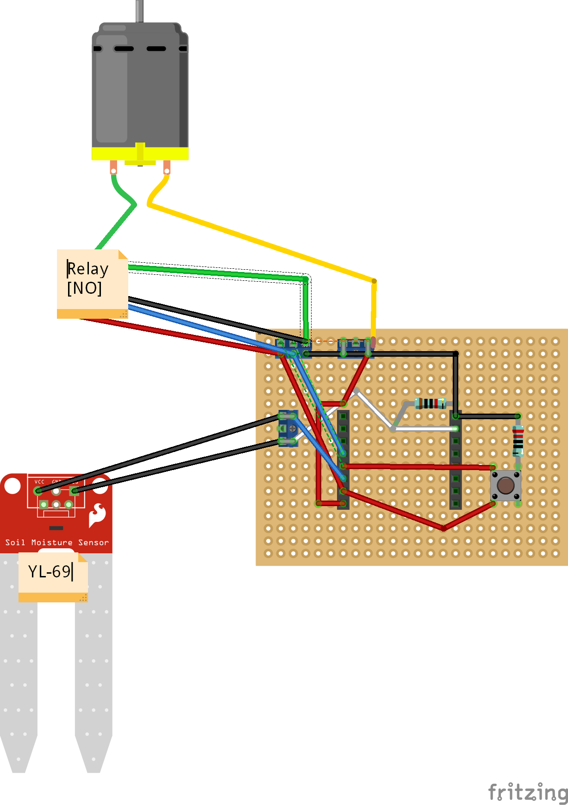

# WaterMePlease
WaterMePlease is a lazy automatic watering station built using Arduino\MicroView. 

The Microcontroller uses the soil moisture sensor to read the humidity of the plantsoil. If this ever hits under 70%, it will start the waterpump for 30 seconds, also having a cooldown time before it can start the pump again so that the water has time to moisten the soil, and so as  not overwatering the plant. 
There is a button on the board for manually running the pump as long as the button is pressed. This is useful when replacing the water of the soda bottle \ water container (tube might be dry inside). 

### Note: 
YL-69 was returning a value between 0 (dry) and 800 (submerged in water) when using a 10k resistor, mapping from 0-100% has been adjusted accordingly in the code. You should test your own sensor as well and update the code accordingly.

## Parts used: 
* 1 x 10k resistor
* 1 x 220ohm resistor
* 1 x Button
* 12V DC power supply
* MicroView (https://www.sparkfun.com/products/12923) (Any Microcontroller and display will do, with a bit of customization)
* 12V Peristaltic pump (60ml/min is used here, represented by a motor on the sketch)
* 1 x YL-69
* Tubes for the pump
* Breadboard or prototyping board

## Fritzing Sketch
A Fritzing sketch is included in the repository. 

